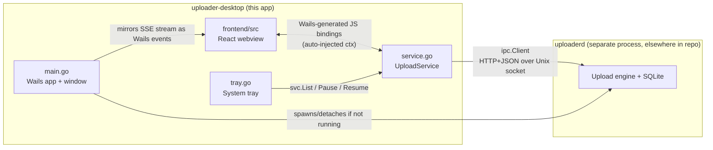

# Uploader Desktop — Architecture

> Last verified: 2026-09-08 against branch `dev` (working tree, uncommitted UI changes included)

## At a Glance

- **What it is:** the desktop UI for the Slike Video CMS uploader — a [Wails v3](https://v3.wails.io/) app (Go backend + React/TypeScript/Tailwind webview) that is a *thin controller* over a separate long-lived engine process, `uploaderd`. It holds no upload state itself.
- **Language/framework:** Go 1.25 (backend, own nested module) + React 18 / TypeScript / Tailwind 4 / Vite (frontend), wired together by Wails v3 bindings.
- **Major components:** the Wails shell ([main.go](main.go)), the daemon supervisor ([daemon.go](daemon.go), [daemon_unix.go](daemon_unix.go), [daemon_windows.go](daemon_windows.go)), the IPC-backed service exposed to the frontend ([service.go](service.go)), the system tray ([tray.go](tray.go)), and the React UI ([frontend/src](frontend/src)).
- **Start reading:** [main.go](main.go) (process wiring) → [service.go](service.go) (the Go↔JS bridge) → [frontend/src/App.tsx](frontend/src/App.tsx) (UI state/orchestration) → [../../packages/ipc/client.go](../../packages/ipc/client.go) (the wire protocol to the engine).
- **Key fact that shapes everything else:** this binary does **not** run the upload engine. It spawns/attaches to `uploaderd` ([../uploaderd](../uploaderd)) as a separate, detached OS process and talks to it over a local Unix-domain-socket HTTP API. Closing this app's window, or killing this app, does not stop an in-progress upload. *(Verified — [daemon.go](daemon.go), [main.go](main.go))*

## System Overview

Uploader Desktop replaces browser-based uploads to the Slike Video CMS with a native app that can ingest very large files without the memory/size limits of browser upload APIs. Per the package comment in [main.go:1-5](main.go#L1-L5), it is explicitly designed as *"a thin Wails controller over the uploaderd daemon"* that "owns no upload state" — the engine runs in `uploaderd` and outlives the window.

Two OS processes are involved, and this repo directory (`apps/uploader-desktop`) is only one of them:

1. **`uploader-desktop`** (this directory) — the GUI. Wails v3 app, single window + system tray, React frontend. Talks to the daemon over IPC; renders state; forwards user commands.
2. **`uploaderd`** ([../uploaderd/main.go](../uploaderd/main.go)) — the engine daemon, a separate Go binary/module living elsewhere in the monorepo. It owns the SQLite-backed upload state, the transport(s) to the upload server, and the transfer scheduling. This document does not cover its internals — see [../uploaderd](../uploaderd) — only how `uploader-desktop` talks to it.

The boundary between them is the shared [packages/ipc](../../packages/ipc) package: a small HTTP+JSON API over a per-user Unix domain socket, used by both the daemon (server side, in `uploaderd`) and this app (client side). `uploader-desktop` depends on `packages/ipc` and `packages/common` only for this boundary — no engine, transport, or storage packages are imported here. *(Verified — [go.mod](go.mod), [service.go](service.go))*

## Project Structure

| Path | Purpose |
|---|---|
| [main.go](main.go) | Process entry point: builds the Wails `application`, creates the window, wires window/tray/file-drop events, starts the daemon supervisor and the event-mirroring goroutine. |
| [daemon.go](daemon.go) | Daemon lifecycle: detects whether `uploaderd` is already listening on its socket, and if not, locates and spawns it (bundled binary in installed builds, `go run ./apps/uploaderd` in a dev checkout), fully detached from this process. |
| [daemon_unix.go](daemon_unix.go) / [daemon_windows.go](daemon_windows.go) | Build-tagged (`!windows` / `windows`) process-detachment primitives (`Setsid` vs. `DETACHED_PROCESS`/`CREATE_NEW_PROCESS_GROUP`) so the spawned daemon survives this app exiting. |
| [service.go](service.go) | `UploadService`: the struct exposed to the frontend as a Wails service. Every method is a thin pass-through to an `ipc.Client` call — this is the entire Go-side API surface the UI can call. |
| [tray.go](tray.go) | System-tray icon/menu: reopen window, pause/resume all, quit; a polling loop keeps the tooltip/label showing live throughput by calling `svc.List`. |
| [frontend/src](frontend/src) | React/TypeScript UI (below). |
| [frontend/bindings](frontend/bindings) | Wails-generated TypeScript bindings for `UploadService` (auto-generated from the Go struct in [service.go](service.go); not hand-edited). |
| [go.mod](go.mod) | Nested Go module; depends on the repo-root module (`code.sli.ke/go/vega`, via a `replace` directive) for `packages/ipc` and `packages/common`, plus `github.com/wailsapp/wails/v3`. |
| [build/](build/) | Wails3 Task-based build system: per-OS Taskfiles ([darwin](build/darwin/Taskfile.yml), [windows](build/windows/Taskfile.yml), [linux](build/linux/Taskfile.yml)), packaging assets (Info.plist, NSIS scripts, launchd plist), and `config.yml` (app metadata). |
| [Taskfile.yml](Taskfile.yml) | Top-level build entry point; dispatches to the OS-specific Taskfile based on `GOOS`. |
| [README.md](README.md) | Unmodified Wails3 project scaffold boilerplate — not project-specific documentation. |

### Frontend structure (`frontend/src`)

| File | Responsibility |
|---|---|
| [main.tsx](frontend/src/main.tsx) | React root bootstrap (`ReactDOM.createRoot` → `<App/>`). |
| [App.tsx](frontend/src/App.tsx) | Top-level state and orchestration: polls/refreshes upload list and metrics, subscribes to the daemon event stream, holds view/filter/search UI state, wires up all user actions. |
| [layout.tsx](frontend/src/layout.tsx) | `Sidebar` (nav + connection indicator) and `TopBar` (title + search + add-media button); defines the `View` union type (`ingest | queue | library | activity | settings`). |
| [views.tsx](frontend/src/views.tsx) | The five screens: `IngestView`, `QueueView`, `LibraryView`, `ActivityView`, `SettingsView`. |
| [ui.tsx](frontend/src/ui.tsx) | Shared presentational components: `IconButton`, `Panel`, `StatTile`, `StageTrack` (pipeline-stage progress), `UploadRow`, `EmptyState`. |
| [icons.tsx](frontend/src/icons.tsx) | Inline SVG icon components (no icon-library dependency). |
| [format.ts](frontend/src/format.ts) | Pure formatting/derivation helpers: the local `Upload`/`Stats`/`LogLine` types (mirroring `ipc.UploadView`), byte/rate/ETA/relative-time formatting, status→CSS-class mapping, and the `STAGES` table that collapses the daemon's fine-grained status values into 5 pipeline stages for `StageTrack`. |
| [vite-env.d.ts](frontend/src/vite-env.d.ts) | Vite ambient type declarations. |

## Startup and Initialization

Sequence, from [main.go](main.go) `main()`:

1. Resolve the daemon's control-socket path (`ipc.DefaultSocketPath()`) and call `ensureDaemon(socket)` ([daemon.go:23-44](daemon.go#L23-L44)):
   - Dial the socket with a 300 ms timeout ([daemon.go:48-55](daemon.go#L48-L55)); if something answers, assume the daemon is already running (installed builds auto-start it via OS service management — see **Build, Runtime, and Deployment**) and do nothing.
   - Otherwise resolve a command to run it: prefer a daemon binary bundled next to this executable ([daemon.go:112-129](daemon.go#L112-L129) — beside the exe on Windows/Linux, under `Contents/Resources` on macOS app bundles); in a dev checkout with no bundled binary, fall back to `go run ./apps/uploaderd` from the repo root, located by walking up until a `go.mod` declaring `module code.sli.ke/go/vega` is found ([daemon.go:88-107](daemon.go#L88-L107)).
   - Detach the child process (`Setsid` on Unix, `DETACHED_PROCESS|CREATE_NEW_PROCESS_GROUP` on Windows) so it outlives this app, redirect its stdout/stderr to a log file under the per-user state directory (or `/dev/null` if that fails), start it, and immediately release it (`cmd.Process.Release()` — this app does not wait on or reap it).
   - Poll the socket for up to 3 seconds so the first UI calls don't race the daemon's listener startup.
   - If no daemon binary and no dev repo root are found at all, log a message telling the operator to run `scripts/dev-stack.sh` and continue — the app still starts, just disconnected. *(Verified — no other daemon-discovery path exists in this file.)*
2. Construct `UploadService` ([service.go:21-31](service.go#L21-L31)): resolve the same socket path, load-or-create a per-user bearer token (`ipc.LoadOrCreateToken`, a random token written 0600 on first run), and build an `ipc.Client`. This does not require the daemon to be up — calls simply fail until it is.
3. Register the `upload.event` type with Wails (`application.RegisterEvent[common.Event]`, in `init()`) so the frontend gets a typed event listener.
4. Build the Wails `application` with `UploadService` as its one registered service and the embedded `frontend/dist` build as static assets.
5. Create the single window (1180×780, min 980×620), with macOS-specific translucent/dark-appearance titlebar options and file-drop enabled.
6. Wire window-level behavior: dropped files call `svc.Enqueue` directly ([main.go:83-89](main.go#L83-L89)); closing the window is intercepted to hide it instead of quitting (`hideOnClose`, [tray.go:61-66](tray.go#L61-L66)); `setupTray` builds the system-tray icon/menu and starts its own polling goroutine.
7. Start `mirrorEvents` in a goroutine ([main.go:104-117](main.go#L104-L117)) — connects to the daemon's SSE event stream and re-emits every event into the Wails frontend event bus, reconnecting with a 1-second backoff forever (the daemon can be down or restart at any time).
8. Call `app.Run()` (blocks for the life of the app).

No other initialization path exists — there is no config file loaded by this app itself; the daemon's own configuration (`SLIKE_SERVER`, transport mode, etc., visible in [../uploaderd/main.go](../uploaderd/main.go)) is inherited by the spawned child from this process's environment, but is not read or set by `uploader-desktop` itself. *(Verified — `daemonCommand` in [daemon.go:75-86](daemon.go#L75-L86) sets no environment; the comment there notes "nothing is hardcoded here" because the child inherits the parent's env.)*

## Components and Responsibilities

### Wails shell (`main.go`)
Owns the OS window, the embedded frontend asset server, and top-level lifecycle wiring (file drop, event mirroring, daemon bootstrap). Depends on `UploadService` (constructed here) and the daemon-supervisor functions in `daemon.go`. Nothing else in this app depends on it — it is the composition root. *(Verified)*

### Daemon supervisor (`daemon.go`, `daemon_unix.go`, `daemon_windows.go`)
Owns the "make sure the engine is running" concern. Depends on `packages/ipc` (socket path, log-file path) and the OS process APIs. Used only by `main.go`, once, at startup — nothing else in this app talks to a spawned daemon process directly; all runtime communication goes through `UploadService`/`ipc.Client` instead. *(Verified)*

### `UploadService` (`service.go`)
The entire Go-side API surface exposed to the frontend via Wails's service-binding mechanism (`application.NewService(svc)` in [main.go:45](main.go#L45)). Wraps `*ipc.Client` one-to-one: `List`, `Enqueue`, `Pause`, `Resume`, `Cancel`, `Metrics`. Holds a single field (`client *ipc.Client`) and no other state — consistent with the "UI owns no upload state" design stated in the package comment. Depended on by `main.go` (file-drop handler, event mirroring driver indirectly via `svc.client`), `tray.go` (list/pause/resume for the tray menu and status loop), and — through Wails-generated JS bindings in [frontend/bindings](frontend/bindings) — every frontend view that calls `UploadService.*`. *(Verified)*

### System tray (`tray.go`)
Adds a persistent tray/menu-bar icon so the app remains reachable after the window is hidden. Two independent mechanisms: a menu (`Open`, `Pause all`, `Resume all`, `Quit`) driving `UploadService` calls, and a background loop (`trayStatusLoop`, polling every 2s) that calls `svc.List` directly — deliberately not driven by the SSE event stream, so the tray "stays correct even if a stray event is missed" ([tray.go:88-89](tray.go#L88-L89)). Depends on `UploadService` and the Wails `application`/`SystemTray` APIs. *(Verified)*

### React frontend (`frontend/src`)
- **`App.tsx`** is the sole stateful component: it polls `UploadService.List`/`Metrics` every 1.5s, subscribes to the `upload.event` Wails event (triggering an immediate re-list, and — for non-`progress` events — appending a formatted line to an in-memory, 200-line-capped activity log), and derives all cross-view statistics (`Stats`) via `useMemo`. All user actions (enqueue via file/folder picker or drag-drop, pause/resume/cancel, pause-all/resume-all) go through `UploadService`.
- **`layout.tsx` / `views.tsx` / `ui.tsx`** are presentational, driven entirely by props from `App.tsx` — no component below `App` calls `UploadService` or holds its own server-derived state.
- **`format.ts`** is the single source of truth for status→stage/color/label mapping and all human-readable formatting, used by both `ui.tsx` and `views.tsx`.

There is exactly one upward dependency path: `main.tsx → App.tsx → {layout, views} → ui.tsx / format.ts / icons.tsx`. *(Verified by import graph in the files read.)*

## System, Request, and Data Flows

### Enqueueing an upload (file picker or drag-and-drop)

1. **File picker:** `App.tsx`'s `addFiles`/`addFolder` call the Wails `Dialogs.OpenFile` runtime API, then `UploadService.Enqueue(path)` for each picked path, then switch the view to `queue` and re-poll.
2. **Drag-and-drop:** files dropped on the window fire `events.Common.WindowFilesDropped` on the **Go side** (the webview never sees the paths — see the comment at [main.go:80-82](main.go#L80-L82)); the handler in `main.go` calls `svc.Enqueue` directly, bypassing the frontend entirely for the enqueue call itself (the resulting state change reaches the UI only through the next poll/event).
3. Either way, `UploadService.Enqueue` → `ipc.Client.Enqueue` → `POST /v1/uploads` (JSON body `{path, cmsFileId?, objectKey?}`) over the Unix socket to `uploaderd`, which returns an upload ID. This app does no validation, chunking, or hashing of the file itself — that is entirely the daemon's responsibility on the other side of the socket.

### Live status flow (poll + push, deliberately redundant)

Two independent update mechanisms feed the same `uploads` state in `App.tsx`, by design (see the tray's comment on the same tradeoff, [tray.go:88-89](tray.go#L88-L89)):

- **Poll:** a 1.5s `setInterval` calls `UploadService.List()` (→ `GET /v1/uploads`) and `UploadService.Metrics()` (→ `GET /v1/metrics`); failure of `List` sets `connected=false` and drives the sidebar's "Engine online/offline" indicator, while `Metrics` failure is swallowed (treated as decorative).
- **Push:** `main.go`'s `mirrorEvents` goroutine holds one long-lived SSE connection (`ipc.Client.Events`, `GET /v1/events`) to the daemon and re-emits every `common.Event` as a Wails `upload.event`; `App.tsx` listens for it and triggers an immediate `refresh()` plus optional activity-log entry. If the connection drops or the daemon restarts, `mirrorEvents` reconnects after a 1-second sleep, forever.

Neither mechanism is the sole source of truth for anything — the actual upload state always comes from the next `List` call; the event stream and the tray's independent poll exist only to make that call happen sooner or to survive a missed event. *(Verified — `App.tsx`'s event handler calls `refresh()`, it does not apply the event payload as state directly, aside from the log line.)*

### Pause / Resume / Cancel

`UploadRow` action buttons (via `RowActions` passed down from `App.tsx`'s `actions`) call `UploadService.Pause/Resume/Cancel(id)` → `ipc.Client` → `POST /v1/uploads/{id}/{pause|resume|cancel}`, then `refresh()`. The tray's "Pause all"/"Resume all" do the same in a loop over the current `List()` result, skipping uploads already in a terminal status (`completed`, `failed`, `canceled`, `paused` — see `terminalStatus` in [tray.go:15-20](tray.go#L15-L20); note this is a locally duplicated status set, distinct from — and slightly different in composition from — `isTerminal`/`running` in [frontend/src/format.ts:66-78](frontend/src/format.ts#L66-L78), which is the frontend's own classification. *(Observed inconsistency — see Gaps.)*

### Error handling

- Daemon unreachable: every `ipc.Client` call returns an error (HTTP dial failure over the Unix socket); `App.tsx`'s `refresh()` catches it and sets `connected=false`; the tray's `summarise()` catches it and shows "engine not running" in the tooltip. No retry/backoff on individual calls — the next poll tick or SSE reconnect is the retry mechanism.
- Enqueue/action failures: `App.tsx`'s per-row action wrapper (`act`) `.catch(console.error)`s — failures are logged to the devtools console only, with no user-facing error surface for a failed pause/resume/cancel/enqueue call. *(Gap — see below.)*
- Non-2xx IPC responses are decoded into `common.ErrNotFound` (for 404) or a generic error via `statusErr` in [../../packages/ipc/client.go:154-166](../../packages/ipc/client.go#L154-L166); this app does not branch on error type anywhere — all callers treat any error the same way (log and/or mark disconnected).

## External Integrations

### `uploaderd` (the upload engine daemon)
- **Purpose:** the actual upload engine — file chunking/hashing, transport selection, retry/resume, and communication with the upload server ([../upload-server-h3](../upload-server-h3)) and object storage. Entirely out of scope for this document; see [../uploaderd/main.go](../uploaderd/main.go) for its own entry point.
- **How this app talks to it:** exclusively through [packages/ipc](../../packages/ipc) — a small HTTP+JSON API served over a per-user **Unix domain socket** (path from `ipc.DefaultSocketPath()`, under the OS user-config directory, e.g. `~/Library/Application Support/vega/uploaderd.sock` on macOS), never a TCP port. Every request carries `Authorization: Bearer <token>`, where the token is a random value shared via a 0600 file at `ipc.StatePath("token")` — the **filesystem is the trust boundary**: any process running as the same OS user can read the token and drive the daemon; the socket keeps the API off the network. *(Verified — [packages/ipc/api.go](../../packages/ipc/api.go), [packages/ipc/client.go](../../packages/ipc/client.go))*
- **Data crossing the boundary:** local file paths (enqueue), upload IDs and lifecycle commands, and read-only progress/status views (`UploadView`) and engine-wide metrics — never file bytes themselves (this app never streams file content; it only tells the daemon which local path to read).
- **Failure behavior:** connection failures are treated as "daemon not running/reachable" everywhere (see **Error handling** above); this app does not distinguish "daemon down" from "daemon returned an error" in its UI beyond the connected/disconnected indicator.
- **Process relationship:** not client/server in the network sense — this app also *launches* `uploaderd` if it isn't already running (see **Startup and Initialization**), but does not manage its lifecycle afterward (no restart-on-crash from this app; that is delegated to OS-level service supervision in installed builds — see **Build, Runtime, and Deployment**).

### Wails v3 runtime (`github.com/wailsapp/wails/v3`)
Not a network integration but the framework boundary between the Go backend and the embedded webview: window/tray management, the service-binding mechanism that turns `UploadService`'s Go methods into generated TypeScript in [frontend/bindings](frontend/bindings), the file dialog and file-drop APIs, and the typed event bus used for `upload.event`. Version pinned in [go.mod:11](go.mod#L11) (`v3.0.0-alpha2.117` — a pre-release).

## Data and Storage

This app persists no application data of its own:
- **No local database** — all upload state lives in `uploaderd`'s store (out of scope here).
- **Shared per-user state directory** (`os.UserConfigDir()/vega`, via `ipc.stateDir()`): this app reads/creates the bearer **token** file and reads the **socket** path from here; it also writes the daemon's **stdout/stderr log** here when it spawns `uploaderd` (`ipc.StatePath("uploaderd.log")`). It does not create or read any other files in this directory. *(Verified — [packages/ipc/api.go:87-97](../../packages/ipc/api.go#L87-L97), [daemon.go:140-148](daemon.go#L140-L148))*
- **In-memory only, frontend side:** the activity log (`App.tsx`'s `log` state) is capped at 200 entries and lost on reload/restart — there is no persistence of the activity history across sessions.
- **Browser storage:** no use of `localStorage`/`sessionStorage`/IndexedDB was found in the frontend source.

## Security

- **Transport confinement:** the control API is reachable only via a Unix domain socket in a per-user directory — not a TCP/network port — so it is not exposed off the local machine. *(Verified — [packages/ipc/client.go:28-40](../../packages/ipc/client.go#L28-L40) dials `"unix"` exclusively.)*
- **Local authentication:** a random bearer token, generated on first run and stored 0600, is required on every request (`Authorization: Bearer`); the trust boundary is explicitly the local filesystem/OS-user account, not network identity. *(Verified — [packages/ipc/api.go:68-85](../../packages/ipc/api.go#L68-L85))*
- **No user-facing authentication in this app:** `uploader-desktop` itself does not implement a login/auth screen or handle CMS credentials — no such code was found in `frontend/src` or the Go files. Whether/how CMS identity (`cmsFileId` in `EnqueueRequest`) is established before reaching this app is **Unclear** from this directory alone.
- **Input handling:** the only user input this app forwards without its own validation is a local filesystem path (from the OS file picker or a native drop event) and free-text search/filter state that never leaves the browser context (used only for client-side list filtering, not sent to the daemon). No sanitization concerns were identified for the daemon calls, since all payloads are simple typed structs marshaled to JSON.
- **Process isolation:** the daemon is deliberately detached from this app's process group/session so it cannot be taken down by killing or debugging this app — a reliability property more than a security one, but relevant to the "the engine must survive the UI" requirement stated throughout the code comments.

## Background and Asynchronous Processing

All background work in this app is UI-side polling/streaming, not job processing:

| Goroutine/loop | Location | Interval/trigger | Purpose |
|---|---|---|---|
| `mirrorEvents` | [main.go:104-117](main.go#L104-L117) | Reconnect loop, 1s backoff | Relays the daemon's SSE event stream into Wails frontend events, forever, for the life of the app. |
| `trayStatusLoop` | [tray.go:90-95](tray.go#L90-L95) | Every 2s | Recomputes the tray tooltip/label from `svc.List()`. |
| Frontend poll | [App.tsx:57](frontend/src/App.tsx#L57) | Every 1.5s (`setInterval`) | Re-fetches `List`/`Metrics` as the redundant fallback to the SSE stream. |

None of these loops perform retries with backoff beyond the fixed 1s (event mirror) / fixed intervals (polls) shown above; none persist their own state across restarts (an app relaunch simply starts fresh and reattaches to whatever the daemon currently reports).

## Configuration

This app itself exposes no user-facing settings screen for engine behavior (the `Settings`/"Engine" view, [views.tsx](frontend/src/views.tsx)'s `SettingsView`, is read-only — it renders `connected` status and `metrics`, and does not appear to submit any configuration back to the daemon based on the props it receives). Configuration inputs found:

| Input | Where consumed | Purpose |
|---|---|---|
| `SLIKE_SERVER`, and other `SLIKE_*` variables referenced in [../uploaderd/main.go](../uploaderd/main.go) | Inherited by the daemon **when this app spawns it** ([daemon.go:75-86](daemon.go#L75-L86)) | These are read by `uploaderd`, not by `uploader-desktop`; this app sets none of them itself, so they must already be present in this app's process environment (e.g., set by a launcher script or the OS) for a dev-spawned daemon to point anywhere other than its built-in default. |
| `WAILS_VITE_PORT` / `PACKAGE_MANAGER` | [Taskfile.yml](Taskfile.yml) build/dev tasks | Dev-server port and package manager choice for `wails3 dev`. |
| `build/config.yml` | Wails build tooling | App metadata (name, bundle identifier, description) used to generate platform build assets — currently still the generic Wails3 scaffold values (`"My Company"`, `com.mycompany.myproduct`, etc.), not yet customized for this product. *(Gap — see below.)* |

No secrets are read directly by this app; the daemon token is generated locally, not configured.

## Build, Runtime, and Deployment

- **Build system:** Wails3's Task-based build ([Taskfile.yml](Taskfile.yml)), dispatching to a per-OS Taskfile ([build/darwin](build/darwin/Taskfile.yml), [build/windows](build/windows/Taskfile.yml), [build/linux](build/linux/Taskfile.yml), plus `ios`/`android` scaffolds present but not evidenced as in active use for this product). The Go backend is a nested module ([go.mod](go.mod)) that `replace`s the repo-root module with `../../` to reach `packages/ipc`/`packages/common` from the monorepo source rather than a published version.
- **Frontend build:** Vite + TypeScript + Tailwind 4 ([frontend/package.json](frontend/package.json)), producing `frontend/dist`, which is embedded into the Go binary via `//go:embed all:frontend/dist` ([main.go:21](main.go#L21)) — the shipped app is a single native executable serving its own UI, no external web server.
- **Daemon bundling (macOS):** [build/darwin/Taskfile.yml](build/darwin/Taskfile.yml) builds `uploaderd` from the repo-root module and copies it into `Contents/Resources/uploaderd` inside the `.app` bundle, then produces a single `.pkg` installer (`pkgbuild`) that also installs [build/darwin/pkg/ke.sli.slike.uploaderd.plist](build/darwin/pkg/ke.sli.slike.uploaderd.plist) to `/Library/LaunchAgents`. That LaunchAgent (`Label: ke.sli.slike.uploaderd`, `RunAtLoad` + `KeepAlive`) auto-starts and restarts the daemon at login independent of the desktop app, per-user, and points at a fixed install path (`/Applications/uploader-desktop.app/Contents/Resources/uploaderd`). Its own comments note the production upload-server target (`SLIKE_SERVER`) is not yet set in the shipped plist — it currently falls back to the daemon's built-in default (`https://localhost:443`) unless overridden. *(Gap — production server address not configured in the installer as of this verification.)*
- **Daemon bundling (Windows):** [build/windows/Taskfile.yml](build/windows/Taskfile.yml) similarly cross-builds `uploaderd.exe` and bundles it via NSIS (`project.nsi`) alongside the app executable, registering autostart there.
- **Dev mode:** `wails3 dev` (via [build/config.yml](build/config.yml)'s `dev_mode`) rebuilds on Go/JS/TS changes with a debounce; `main.go`'s `ensureDaemon` handles bringing up the engine in dev by `go run`-ing it from the repo root when no bundled binary exists, so a bare `wails3 dev` run in this directory is sufficient to exercise the full UI↔daemon path without a separate manual daemon start (falling back to a `scripts/dev-stack.sh` hint if no repo root is discoverable at all).
- **Server-mode build:** [Taskfile.yml](Taskfile.yml) exposes `build:server`/`run:server`/`build:docker`/`run:docker` tasks (Wails3's built-in "headless HTTP server" mode) delegating to `build/Taskfile.yml`'s `common:*` tasks — present in the scaffold but no evidence in this app's own Go source (`main.go` unconditionally creates a GUI window) that this app is actually deployed or exercised in that mode. *(Unclear — scaffold capability, not confirmed in active use.)*

## Design Decisions and Constraints

- **Two-process split (documented in code, not just this doc):** the package comment on `main.go` and the daemon-supervisor comments in `daemon.go` are explicit that the engine must survive UI close/crash/logout, which is why it is a detached sibling process rather than a goroutine inside this app. This is the single constraint that shapes the rest of the design (thin `UploadService`, poll+push redundancy, tray as an independent access point).
- **No shared state, only a thin RPC client:** `UploadService` holds nothing but an `*ipc.Client`; every "read" the UI needs is re-fetched from the daemon rather than cached and pushed incrementally, which is why the event stream exists purely to *trigger* a re-fetch rather than to carry authoritative deltas (see **System, Request, and Data Flows**).
- **Deliberate redundancy between poll and push**, called out explicitly in the tray's own comment ([tray.go:88-89](tray.go#L88-L89)): correctness (poll) is prioritized over efficiency (push-only), accepting the cost of a request every 1.5–2 seconds even when idle.
- **Filesystem-as-trust-boundary IPC:** rather than any cryptographic pairing between this app and the daemon, both simply trust "same OS user, same config directory" — simple, but means any other process running as that user can also read the token and drive the daemon (see **Security**).

## Architecture Gaps and Unclear Areas

| Area | Observed state | Gap or uncertainty | Impact |
|---|---|---|---|
| User-facing error surface | `App.tsx`'s action handlers `.catch(console.error)` on enqueue/pause/resume/cancel failures | No toast/banner/inline error is rendered for a failed action — only the devtools console | A user who clicks Pause/Resume/Cancel while, e.g., the daemon is mid-restart gets silent failure with no visible feedback |
| Terminal-status duplication | `terminalStatus` in [tray.go:15-20](tray.go#L15-L20) vs. `isTerminal`/`running` in [frontend/src/format.ts:66-78](frontend/src/format.ts#L66-L78) | Two independently maintained status classifications (Go-side tray, TS-side frontend) that happen to agree today but have no shared source of truth | A future daemon status value added to one list and not the other would silently miscategorize an upload in either the tray or the UI |
| Production upload-server address | The macOS LaunchAgent plist ships with `SLIKE_SERVER` commented out, so an installed daemon defaults to `https://localhost:443` | Whether/where the real production server address is injected at build or install time is not evidenced in this directory | An installer built from this config as-is would point the daemon at localhost, not a real upload server, unless something outside this directory sets the environment for the LaunchAgent |
| CMS authentication | No login screen, JWT handling, or credential storage found anywhere in `apps/uploader-desktop` | How a user's CMS identity reaches `EnqueueRequest.CMSFileID` or the daemon's own auth (referenced in `../uploaderd/main.go`'s flags) is not implemented or wired up in this app | Cannot confirm from this directory alone how this app authenticates a given upload to the CMS/upload-server — likely lives entirely in `uploaderd` or a not-yet-built login flow |
| `build/config.yml` product metadata | Still contains Wails3 scaffold placeholder values (`"My Company"`, `com.mycompany.myproduct`, `"A program that does X"`) | Not yet customized for this product | Build assets (Info.plist, installer metadata) generated from this file would currently ship with placeholder branding |
| Server-mode build tasks | `Taskfile.yml` exposes `build:server`/`run:server`/`build:docker` | `main.go` has no conditional/headless code path — it always creates a GUI window | Unclear whether these Wails3-scaffold-provided tasks are actually usable for this app as written |
