# Slike Uploader — Platform Architecture

**Status:** Draft for review · **Version:** 0.1 · **Date:** 2026-07-21
**Audience:** Engineering, Security/Compliance, Product
**Decision gate:** Implementation begins only after this document is reviewed and approved.

---

## 0. Executive summary & the one decision that shapes everything

We are building a commercial-grade desktop upload platform that replaces browser uploads for the existing Slike Video CMS. It behaves like Dropbox / Aspera Connect: a **background upload engine** is the product, and the **UI is only a controller**. The engine must transfer files from a few MB to several TB over unreliable, high-latency, high bandwidth-delay-product (BDP) WAN links, survive crashes and reboots, and never restart an upload from zero unless the user explicitly deletes it.

**Approved data-path decision (hybrid, protocol-primary):**

- **Primary path:** a **custom binary transport protocol (SLKT)**, server-in-path, over TLS 1.3/TCP for v1, architected to migrate to QUIC without touching the upload engine.
- **Failover path:** **direct-to-object-storage** (S3 multipart to DigitalOcean Spaces over HTTPS/443), used automatically when the custom transport is blocked or degraded — the common case being **enterprise firewalls / deep-packet inspection** that block non-standard ports or protocols.

The two paths are unified by a single insight that makes the whole system tractable:

> **Every upload is exactly one S3-style multipart upload. A protocol "chunk" *is* a multipart "part". Parts may be contributed either by the server (custom path) or by the client (direct path). Assembly — `CompleteMultipartUpload` — is identical regardless of how each part arrived.**

This means the assembler, the manifest, the resume logic, and the integrity model are **transport-agnostic**. We can build the simpler failover path first, then layer the custom protocol on top as a throughput optimization for the primary path, reusing all of the state, resume, and verification machinery.

**SOC2 is a first-class, cross-cutting requirement** (Security, Availability, Processing Integrity, Confidentiality). It is not a section bolted on at the end; it is threaded through the security model, the audit/event design, key management, and the observability plan, and mapped explicitly to the Trust Services Criteria in §14.

### 0.1 Guiding engineering principles (non-negotiable)

The architecture below is deliberately capable, but the **code that implements it must be minimal, flat, and idiomatic Go**. Sophistication belongs in the *design*, not in the *source*. These principles override any temptation toward cleverness and apply to every package, in every phase:

- **Simple and elegant — the way Go is known for.** Prefer small, obvious functions over abstractions that need a diagram to follow. If a reader has to hold more than one file in their head to understand a function, it is too deep.
- **Shallow, not clever.** Avoid deep call stacks, generic gymnastics, reflection, and speculative interfaces. Interfaces exist only where we genuinely swap implementations (transport, storage, repos, clock) — not "just in case." Accept concrete types; return concrete types; keep interfaces small and defined at the consumer.
- **Minimal surface.** No dead code, no unused config knobs, no framework-for-a-framework. Every type, field, and dependency earns its place or is deleted. Fewer packages doing clear jobs beats many thin packages.
- **Readable by a human on first pass.** Names say what they do; errors are wrapped with context; control flow is linear and early-returning. Comments explain *why*, never *what*. Match the surrounding code's idiom.
- **Standard library first.** Reach for `net`, `crypto/tls`, `database/sql`, `log/slog`, `context`, `io` before pulling a dependency. A new dependency must justify itself against the maintainability and SOC2 supply-chain cost.
- **Boring is a feature.** Straightforward, well-tested, predictable code that thousands of users can rely on beats a smaller line count achieved through indirection. Long-term maintainability is the explicit priority over short-term implementation speed.

Concretely: the hexagonal boundaries (§4) exist to keep each package small and testable, **not** to add layers. If a layer does not make the code simpler to read or test, it does not belong.

---

## Table of contents

1. High-level system architecture
2. Component interaction diagrams
3. Desktop architecture
4. Upload engine architecture
5. Custom protocol specification (SLKT)
6. Wire protocol layout
7. Session lifecycle
8. Upload state machine
9. Scheduler design
10. Worker pool design
11. SQLite schema (desktop) + server store
12. Server architecture
13. Storage abstraction
14. Security model (incl. SOC2 mapping)
15. Failure recovery strategy
16. Performance optimization strategy
17. Testing strategy
18. Incremental implementation roadmap

Appendices: A) Deliberate deviations from the brief, B) Open questions for review, C) Glossary.

---

## 1. High-level system architecture

Five macro-components:

1. **Uploader Desktop (`apps/uploader-desktop`)** — Wails v3 + React/TS/Tailwind shell. Reuses existing CMS React components. It is a *thin controller*: login, queue, history, stats, settings, diagnostics, logs. It talks to the local engine over a local RPC channel; it holds no upload state of its own.
2. **Upload Engine Daemon (`uploaderd`)** — a **separate long-lived OS process** owning the SQLite database, the transport(s), the scheduler, and the worker pools. Survives UI close/crash/logout. Auto-starts via the OS service manager. **This is the product.**
3. **Upload Server (`apps/upload-server`)** — stateful data plane that terminates SLKT sessions, plus a control plane that mints direct-upload credentials, tracks multipart state in a shared relational store, assembles files, verifies checksums, notifies the CMS, and reaps stale uploads. Horizontally scalable.
4. **Object Storage** — DigitalOcean Spaces (S3-compatible) as the durable chunk/part store and final-asset store. Abstracted behind an `ObjectStore` port so other stores can be added.
5. **Existing Video CMS** — unchanged. Provides the Login/JWT API and receives "asset ready" notifications. We integrate; we do not modify its auth APIs.

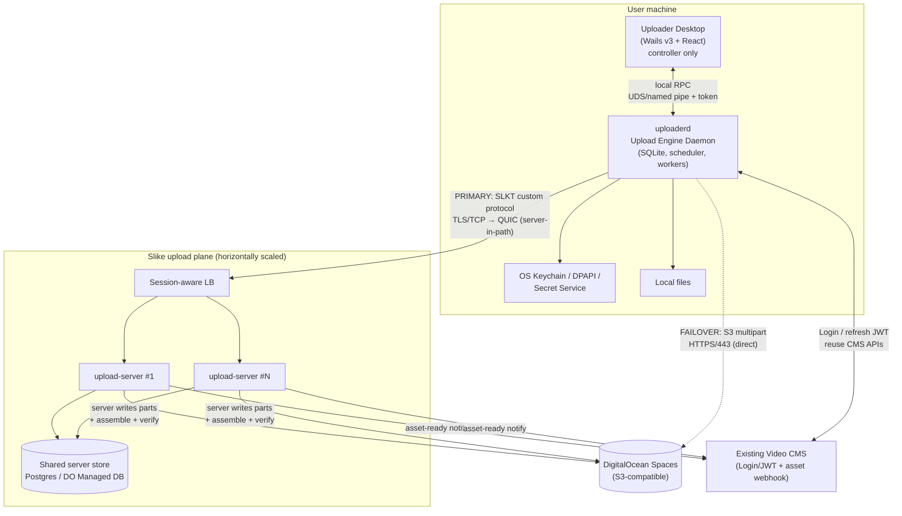

**Design principles applied throughout:** Hexagonal (ports & adapters), repository pattern, dependency injection at the composition root, `context.Context` cancellation everywhere, an internal event bus, worker pools, streaming pipelines, explicit state machines, and interface-driven boundaries so every subsystem is independently testable.

---

## 2. Component interaction diagrams

### 2.1 Control-plane: starting an upload (happy path, primary transport)

```mermaid
sequenceDiagram
  autonumber
  participant UI as Desktop UI
  participant D as uploaderd
  participant DB as SQLite
  participant S as upload-server
  participant OS as Spaces

  UI->>D: EnqueueUpload(path, priority, cmsFileId)
  D->>DB: INSERT upload(Queued) + manifest(placeholder)
  D->>D: Prepare: stream-hash SHA256, size, choose chunk size
  D->>DB: UPDATE manifest(chunkSize,count,sha256) state=Ready
  D->>S: SLKT SESSION_OPEN(jwt, manifest)
  S->>S: verify JWT + ownership; InitMultipart(Spaces)
  S->>OS: CreateMultipartUpload -> multipartId
  S->>DB: (server store) persist upload+multipartId
  S-->>D: SESSION_READY(sessionId, missingParts=[all])
  loop transfer
    D->>S: CHUNK_DATA(streamId, partIdx, bytes, crc32c, sha256)
    S->>OS: UploadPart(multipartId, partIdx) -> ETag
    S-->>D: CHUNK_ACK(partIdx, ETag) + FLOW_UPDATE(credits)
    D->>DB: mark chunk Acked, persist ETag, checkpoint
  end
  D->>S: SESSION_COMPLETE(finalSha256)
  S->>OS: CompleteMultipartUpload(parts[])
  S->>OS: HEAD final; verify size + checksum
  S->>CMS: notify asset-ready(fileId, key, sha256)
  S-->>D: COMPLETED
  D->>DB: upload state=Completed
```

### 2.2 Failover negotiation (custom transport blocked by firewall)

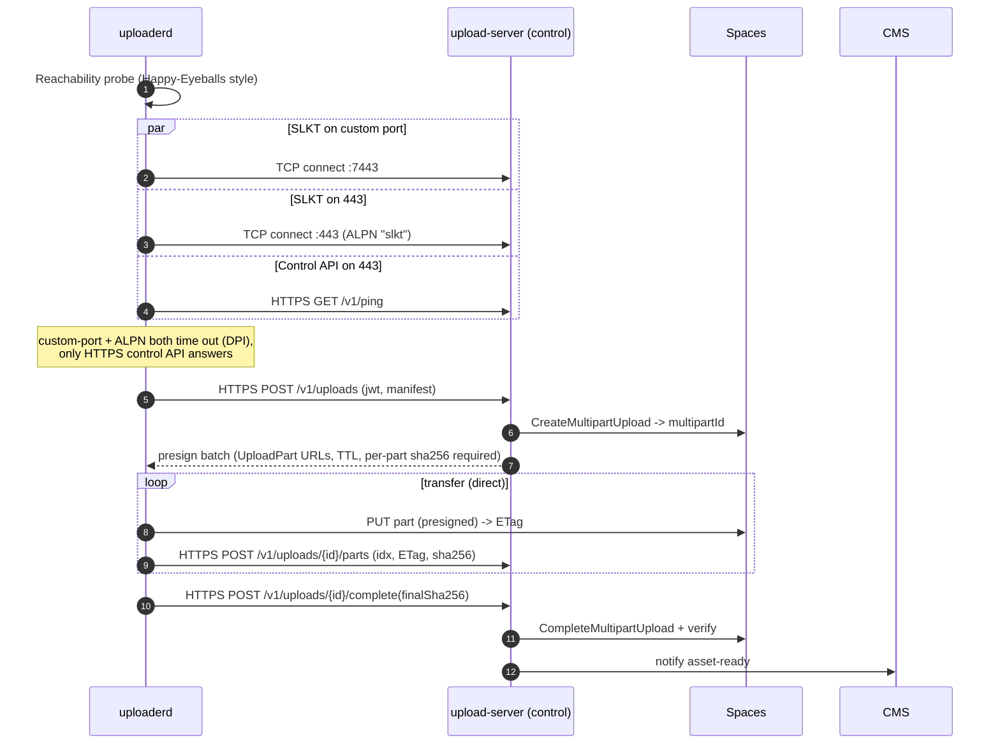

Both diagrams converge on the same server-side `Complete + verify + notify`. The only difference is *who* calls `UploadPart` and over *what* transport.

### 2.3 UI ↔ Engine (controller pattern)

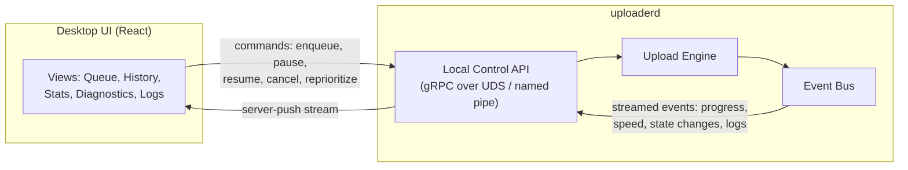

The UI subscribes to an event stream; it renders state, it does not own it. If the UI dies, the engine keeps transferring; on relaunch the UI reconnects and re-reads current state from the engine (which reads from SQLite).

---

## 3. Desktop architecture

### 3.1 Two-process model (why the engine is a separate daemon)

The single hardest requirement is: *the upload engine must keep running when the window closes, the app is minimized, the UI crashes, or the user logs out and back in.* A GUI framework's process lifecycle is tied to its window/event loop, so we **decouple the engine into its own OS process**, `uploaderd`, and make the Wails app a client of it.

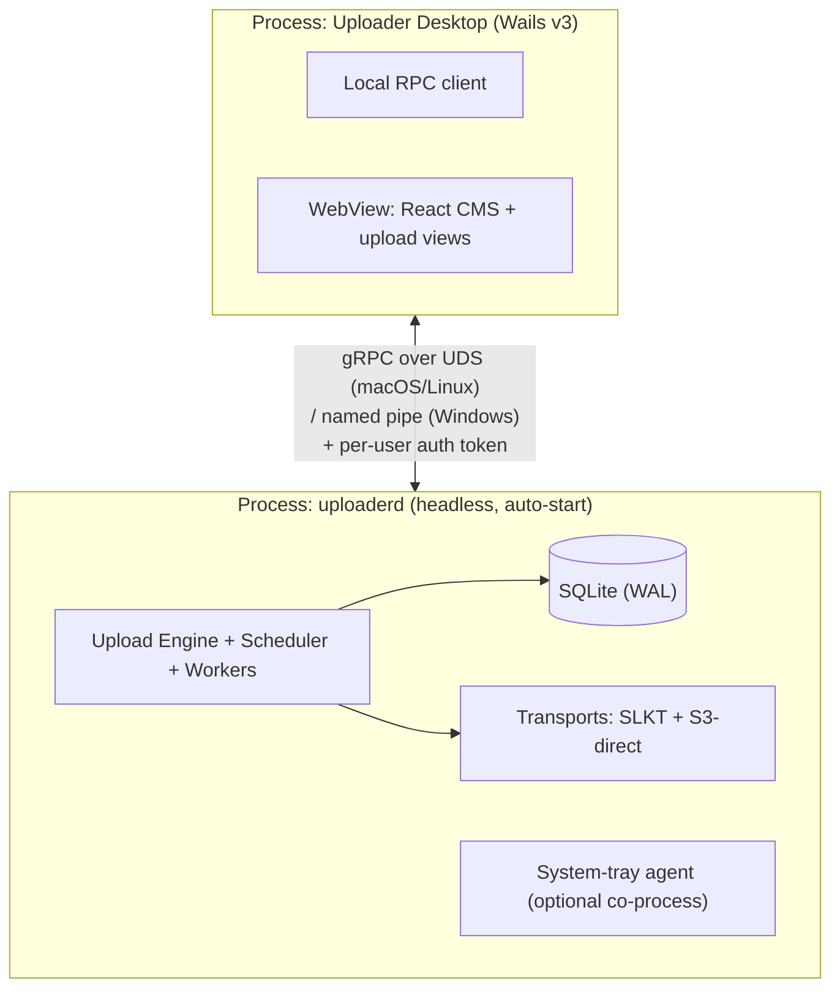

- **Local RPC:** gRPC over a **Unix domain socket** (macOS/Linux) or **named pipe** (Windows), never a TCP port, to avoid exposing the engine to other machines. A per-user token (created at first run, stored in the keychain, `chmod 600`) authenticates the UI to the daemon so a hostile local process cannot drive uploads.
- **Auto-start & supervision:** `launchd` LaunchAgent (macOS), `systemd --user` unit (Linux), Windows Service or Scheduled Task (Windows). The service manager restarts the daemon on crash and at login/boot.
- **Single-instance:** lockfile + advisory lock on the socket; a second launch attaches to the existing daemon.
- **System tray:** minimize-to-tray with pause/resume/quit and aggregate progress. The tray lives with (or alongside) the daemon so closing the main window does not stop transfers.

### 3.2 Reusing the existing CMS UI

- The Wails WebView loads the existing React/PWA CMS surface. We reuse the CMS's components and styling (the shared player SDK CSS core tokens are available as a design source). The additional working directory `slike-player/.../css/core` is treated as a design-token dependency, not vendored code.
- The **Upload button** is rewired: instead of calling browser upload APIs (`fetch`/XHR/`<input type=file>` streaming), it invokes a **native bridge** exposed by Wails that forwards to the daemon's `EnqueueUpload`. A native file picker (Wails dialog) selects paths; the daemon reads bytes directly from disk (no browser memory buffering, which is what caps browser uploads at large sizes).
- Everything else in the CMS continues to run as a normal web app inside the WebView, hitting existing CMS APIs with the stored JWT.

### 3.3 Required screens (all controller views over engine state)

| Screen | Source of truth | Notes |
|---|---|---|
| Login | CMS Login API | JWT stored in keychain; auto-refresh by daemon |
| Upload Queue | engine `queue` + `uploads` | reorder/priority, pause/resume/cancel |
| Search | CMS APIs | reuse existing CMS search |
| Upload History | engine `uploads` (terminal states) | filter, re-verify, open in CMS |
| Transfer Statistics | engine `transfer_statistics` | live + historical graphs |
| Settings | engine `settings` | bandwidth cap, concurrency, paths, transport prefs |
| Diagnostics | engine + transport probes | reachability, path in use, MTU/RTT, NAT |
| Logs | engine `logs` (structured) | tail + export bundle |

---

## 4. Upload engine architecture

Hexagonal core. The domain (engine, scheduler, state machines, manifests) depends only on **ports** (interfaces); concrete **adapters** are injected at the composition root.

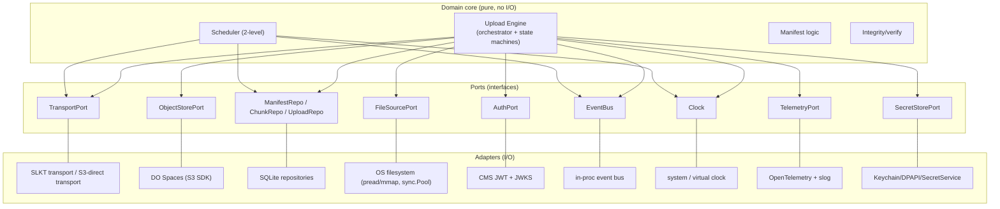

### 4.1 Package layout (`packages/`)

| Package | Responsibility | Depends on |
|---|---|---|
| `common` | shared types, IDs, errors, result helpers, config | — |
| `logger` | structured logging (slog), redaction, log sinks | common |
| `telemetry` | metrics, tracing hooks, bandwidth sampler | common, logger |
| `database` | SQLite driver, migrations, connection mgmt, WAL config | common |
| `storage` | `ObjectStore` port + Spaces/MinIO adapters | common |
| `manifests` | manifest model + persistence + missing-set math | common, database |
| `resumable` | resume/checkpoint logic, crash-recovery reconstruction | manifests, database |
| `protocol` | SLKT frame definitions, codec, version negotiation, capabilities | common |
| `transport` | `Transport` port + SLKT(TCP/TLS) adapter + S3-direct adapter + path chooser | protocol, storage, telemetry |
| `scheduler` | upload-level + chunk-level scheduling, fairness, adaptivity | manifests, telemetry |
| `uploader` | the engine: orchestration, state machines, worker pools, event bus | all of the above |
| `auth` | JWT validation/refresh, JWKS, keychain-backed secret store | common |

`apps/uploader-desktop` and `apps/upload-server` wire these packages together; **no business logic lives in `apps/`** and **no code is duplicated between them**.

### 4.2 Data flow inside the engine (per upload)

```
FileSource(pread, pooled buf) ──▶ Chunker(adaptive size) ──▶ Scheduler(lease) ──▶ Worker
      ──▶ Transport.SendChunk() ──▶ [ACK] ──▶ ChunkRepo.MarkAcked + checkpoint ──▶ Manifest.MissingSet--
```

Backpressure propagates upstream via transport credits → scheduler withholds leases → workers idle → file reads pause. Memory is therefore bounded by `workers × bufferSize`, independent of file size (see §16).

---

## 5. Custom protocol specification (SLKT)

**Name:** SLKT ("Slike Transport"). **Model:** a *persistent, multiplexed, session-oriented streaming protocol* — not request/response. A session outlives individual TCP connections and individual app runs (it can be resumed by ID).

### 5.1 Transport design: hybrid UDP + TCP (FASP/UDT-style), QUIC-ready

SLKT uses a **hybrid UDP + TCP** transport, the same shape as Aspera FASP and UDT — chosen because a single TCP flow collapses on high bandwidth-delay, lossy WAN links, exactly the conditions this product targets:

- **Bulk DATA over UDP.** Data packets are not subject to TCP's per-flow congestion control, so throughput is governed by our own pacing/loss-recovery rather than by TCP backing off on every loss event.
- **CONTROL + reliability feedback over TCP.** Session/part setup, completion, and — crucially — **aggregated selective NAKs** (the byte ranges still missing) travel on a reliable TCP channel. Gap-based NAKs, not per-packet ACKs: per-packet ACKs over TCP would add latency and re-introduce the very bottleneck we are avoiding. The client retransmits only the NAK'd gaps over UDP and loops until the server acknowledges the whole part.
- **Integrity.** Each datagram carries the SLKT frame header CRC (§6); the server verifies a CRC32C over the fully reassembled part before it touches storage; the engine verifies the whole-file SHA256 after assembly. Three layers, cheapest first.

**Implemented** in `packages/transport/slkt` (client + server) with NAK-driven retransmit, a shared token-bucket **pacer** (fixed-rate v1), and enlarged socket buffers. It satisfies `storage.ObjectStore`, so the engine, scheduler, manifests, and server assembly are **untouched** — SLKT is just another object-store adapter beside `HTTPStore` and direct-to-Spaces.

**QUIC migration.** QUIC is itself reliable-streams-over-UDP with built-in loss recovery, BBR-like congestion control, 0-RTT resume and connection migration. Moving to it means **deleting** our manual UDP-retransmit + TCP-NAK + pacer and mapping each part onto a QUIC stream; the frame *semantics* and the `ObjectStore` boundary are unchanged. Because the engine only sees the port, this touches `packages/transport` only.

> Follow-ons (P4): the fixed-rate pacer becomes RTT-driven BBR-style congestion control (§5.4, §16); per-part in-memory reassembly becomes disk-backed for multi-GB parts; the reliable channel gains TLS.

### 5.2 Capabilities (negotiated, not assumed)

`TLS 1.3` (mandatory), `JWT auth`, `multiplexed streams`, `segmented transfer`, `chunk ACKs`, `resumable sessions`, `manifests`, `integrity (CRC32C + SHA256)`, `adaptive flow control`, `congestion awareness`, `out-of-order chunk acceptance`, `parallel workers`, `server backpressure`, `optional compression`, `optional dedup`, `version negotiation`. Each is advertised in the HELLO/CAPABILITY exchange; either side may decline an optional capability.

### 5.3 Streams

- **Stream 0 — Control:** HELLO, AUTH, SESSION_OPEN/RESUME/READY, MANIFEST, FLOW_UPDATE, PING/PONG, BACKPRESSURE, DEDUP_*, ERROR, GOODBYE, COMPLETE. Reliable, ordered.
- **Streams ≥1 — Data:** carry CHUNK_DATA and inline CHUNK_ACK. Independent; a stall on one does not block others (native over QUIC; over TCP we spread data streams across the connection pool to approximate independence).

### 5.4 Flow control & congestion awareness

- **Credit-based flow control** (HTTP/2 / QUIC style): the receiver advertises per-stream and per-session **byte credits** via `FLOW_UPDATE`. Senders must not exceed available credit. The **server implements backpressure** by shrinking credits when its storage-write pipeline (UploadPart to Spaces) falls behind — this is explicit, first-class server-side backpressure, not TCP's implicit signal.
- **Congestion control (app-level, BBR-inspired):** the sender continuously estimates **delivery rate** (ACKed bytes / interval, EWMA) and **min RTT** (via PING/PONG timestamps) to compute a **bandwidth-delay product** and set a **pacing rate** and an in-flight cap across the connection pool. This remains **fair** to competing traffic by targeting the estimated bottleneck bandwidth rather than blindly filling buffers, and by backing off on sustained RTT inflation (bufferbloat signal). Over QUIC, native CC replaces this.
- **Adaptive chunk sizing:** chunk size is a function of measured throughput and RTT (larger on fat, stable links; smaller on lossy links to cut re-send cost), clamped by the multipart constraints in §13.

### 5.5 Out-of-order & idempotency

Data streams may deliver chunks out of order; the server keys each write by `(uploadId, partIndex)`, so ordering is irrelevant and **re-delivery of any chunk is a no-op** (idempotent). This is the backbone of both resume and exactly-once semantics.

---

## 6. Wire protocol layout

All integers big-endian (network order). Every SLKT message is a **frame**: a fixed 26-byte header followed by a type-specific payload. Confidentiality and on-the-wire integrity come from TLS 1.3; SLKT adds application-level integrity (CRC32C fast-path + SHA256 strong) and replay defense. (Implemented in `packages/protocol`; the authoritative byte layout is the offset table in `frame.go`.)

### 6.1 Frame header (26 bytes, fixed)

```
 0                   1                   2                   3
 0 1 2 3 4 5 6 7 8 9 0 1 2 3 4 5 6 7 8 9 0 1 2 3 4 5 6 7 8 9 0 1
+-+-+-+-+-+-+-+-+-+-+-+-+-+-+-+-+-+-+-+-+-+-+-+-+-+-+-+-+-+-+-+-+
|   MAGIC 'S' 'L' |  VER  | TYPE  |            FLAGS            |   MAGIC(16)=0x534C VER(8) TYPE(8) FLAGS(16)
+-+-+-+-+-+-+-+-+-+-+-+-+-+-+-+-+-+-+-+-+-+-+-+-+-+-+-+-+-+-+-+-+
|                          STREAM ID (32)                       |
+-+-+-+-+-+-+-+-+-+-+-+-+-+-+-+-+-+-+-+-+-+-+-+-+-+-+-+-+-+-+-+-+
|                     FRAME SEQUENCE (64)                        |  monotonic per session; replay defense
|                                                               |
+-+-+-+-+-+-+-+-+-+-+-+-+-+-+-+-+-+-+-+-+-+-+-+-+-+-+-+-+-+-+-+-+
|                      PAYLOAD LENGTH (32)                       |  bytes of payload following header
+-+-+-+-+-+-+-+-+-+-+-+-+-+-+-+-+-+-+-+-+-+-+-+-+-+-+-+-+-+-+-+-+
|                     HEADER CRC32C (32)                         |  covers the 20 preceding header bytes
+-+-+-+-+-+-+-+-+-+-+-+-+-+-+-+-+-+-+-+-+-+-+-+-+-+-+-+-+-+-+-+-+
|                        PAYLOAD (var)                           |
```

- **MAGIC** `0x534C` ("SL") — frame-sync + quick reject of garbage.
- **VER** — protocol version; negotiated in HELLO, constant thereafter.
- **TYPE** — frame type (table below).
- **FLAGS** — bit field: `FIN`, `COMPRESSED`, `LAST_PART`, `RESUME`, `NEEDS_ACK`, `URGENT`, reserved.
- **STREAM ID** — 0 = control; odd = client-initiated data; even = server-initiated (mirrors QUIC parity for painless migration).
- **FRAME SEQUENCE** — per-session monotonic counter; the server rejects non-monotonic/duplicated sequences on the control stream (replay protection).
- **PAYLOAD LENGTH** — bounded (default max 8 MiB payload) to cap parser memory.
- **HEADER CRC32C** — catches header corruption before we trust the length field.

### 6.2 Frame types

| TYPE | Name | Stream | Payload summary |
|---|---|---|---|
| 0x01 | HELLO | 0 | supported versions, capabilities bitmap, client build |
| 0x02 | HELLO_ACK | 0 | chosen version, granted capabilities |
| 0x03 | AUTH | 0 | JWT (access), client nonce |
| 0x04 | AUTH_ACK | 0 | server nonce, session TTLs |
| 0x05 | SESSION_OPEN | 0 | manifest header (uploadId, fileId, size, sha256, chunkSize, count) |
| 0x06 | SESSION_RESUME | 0 | sessionId/uploadId |
| 0x07 | SESSION_READY | 0 | sessionId, multipartId ref, **missing-parts bitmap/RLE**, credits |
| 0x10 | CHUNK_DATA | ≥1 | partIndex(32), offset(64), len(32), CRC32C(32), SHA256(256), bytes |
| 0x11 | CHUNK_ACK | ≥1 | partIndex(32), ETag, status |
| 0x12 | CHUNK_NAK | ≥1 | partIndex(32), reason (crc/sha mismatch, storage error) |
| 0x20 | FLOW_UPDATE | 0/≥1 | stream credit delta, session credit delta |
| 0x21 | BACKPRESSURE | 0 | pause/resume, suggested rate |
| 0x22 | PING | 0 | echo token, send-timestamp |
| 0x23 | PONG | 0 | echoed token + timestamps (for RTT) |
| 0x30 | DEDUP_QUERY | 0 | chunk sha256 list |
| 0x31 | DEDUP_HIT | 0 | indices already present server-side (skip upload) |
| 0x40 | SESSION_COMPLETE | 0 | final sha256, total parts |
| 0x41 | COMPLETED | 0 | final object key, verified sha256 |
| 0x50 | ERROR | 0/≥1 | code, retryable flag, message |
| 0x51 | GOODBYE | 0 | graceful close, reason |

**Missing-parts encoding:** run-length-encoded ranges (not a raw bitmap) so a 5 TB file with 500 MB parts (~10k parts) resumes with a tiny `SESSION_READY`. This is what makes resume O(gaps), not O(file size).

### 6.3 Versioning

`VER` in every header + explicit HELLO negotiation. Unknown frame `TYPE` on a known version with the `reserved`/`must-understand` bit clear is *ignored* (forward-compat); with the bit set it is a protocol error. This lets us add frames without breaking old peers.

---

## 7. Session lifecycle

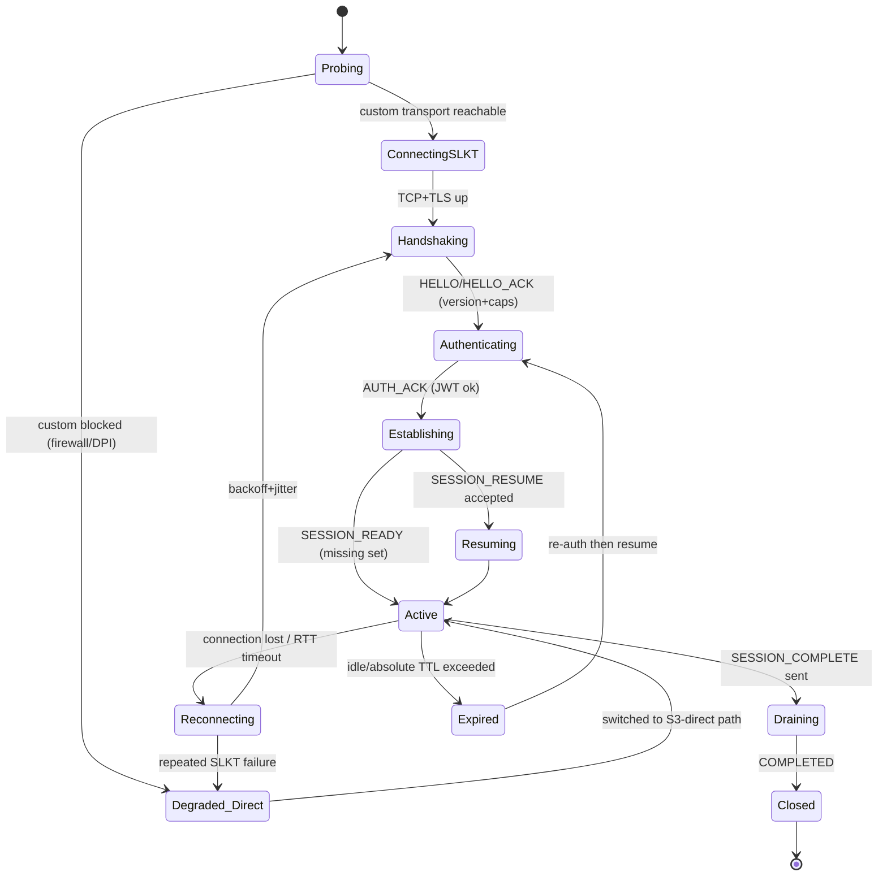

- **Probing / path selection** uses a *Happy-Eyeballs*-style race: try SLKT on the custom port **and** on 443 (ALPN `slkt`) **and** the HTTPS control API concurrently; pick the first that completes the handshake within a deadline. Persist the winning path per network fingerprint (SSID/gateway) so subsequent uploads on the same network skip the probe.
- **Reachability failover** is triggered by: connect timeout, TLS/ALPN rejection, DPI resets, or sustained loss making SLKT slower than a direct-path estimate. Failover **reuses the same manifest and multipart upload** — no restart.
- **Session TTLs:** idle timeout (e.g. 5 min → PING keepalive) and absolute TTL (e.g. 24 h) after which re-auth + resume is required. Server persists enough state (multipartId, part ETags) to resume across TTL and across server instances.

---

## 8. Upload state machine

Two nested machines: **per-upload** and **per-chunk**. Both are persisted after every transition (nothing critical lives only in memory).

### 8.1 Per-upload

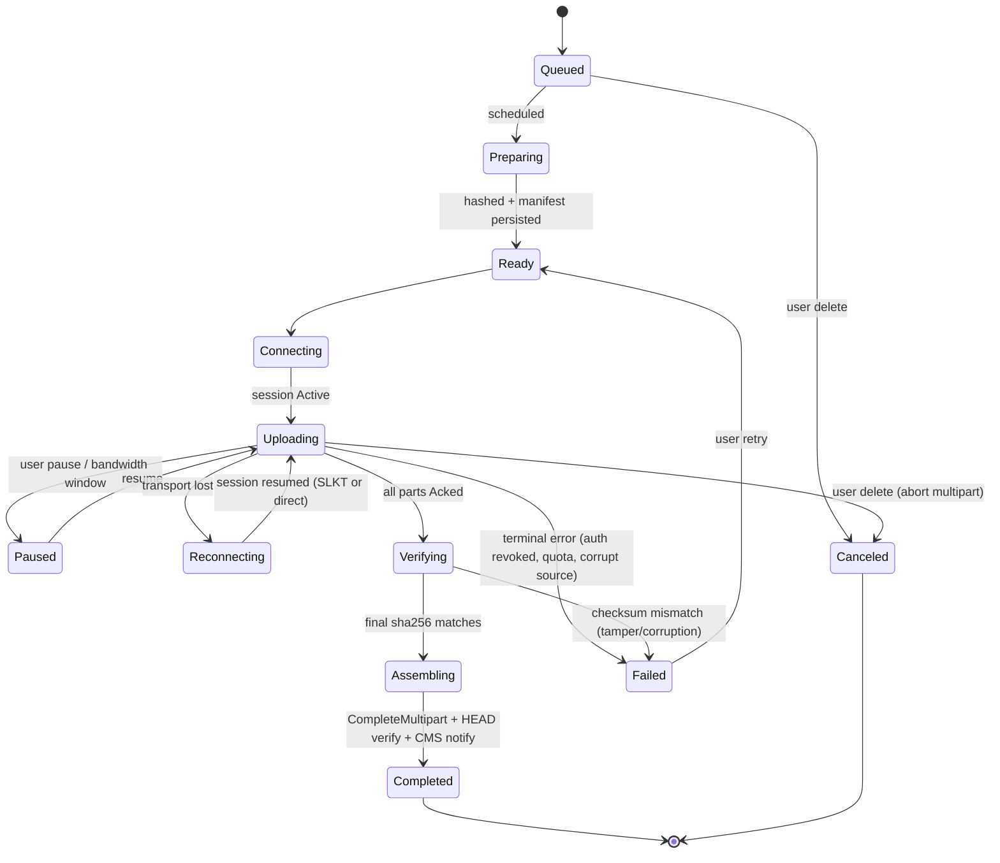

Key invariant: **a transition to `Completed` requires a verified end-to-end SHA256 match after assembly.** Anything less is `Verifying`/`Failed`, never silently "done."

### 8.2 Per-chunk (part)

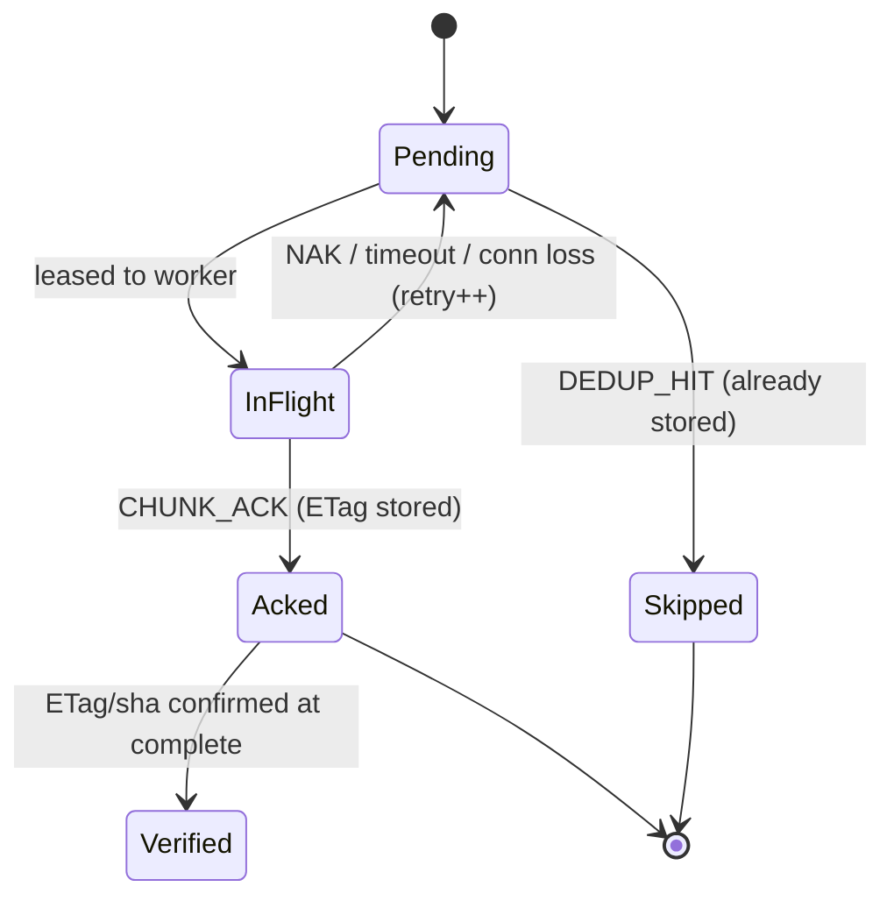

On daemon restart, any chunk found `InFlight` is reset to `Pending` (the transfer was interrupted) — deterministic recovery.

---

## 9. Scheduler design

Two levels, both adaptive.

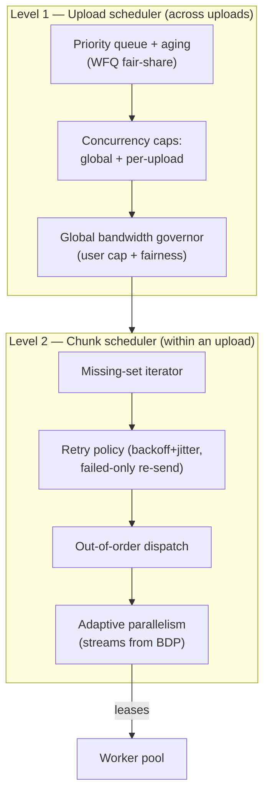

- **Level 1 — upload scheduling:** priority queue with **weighted fair queuing** so a huge upload cannot starve small ones; **aging** bumps long-waiting items to prevent starvation. Honors global concurrency cap (≥40 simultaneous uploads required) and a user-set **global bandwidth cap**, distributed fairly across active uploads.
- **Level 2 — chunk scheduling:** iterates the **missing set** (RLE ranges from the manifest), dispatches out-of-order, **retries only failed chunks** with exponential backoff + jitter, and **adapts parallelism** — the number of concurrent data streams/workers per upload is derived from the live BDP estimate (more in-flight on fat high-latency links; fewer on lossy/thin links to limit re-send waste).
- **Determinism:** scheduling decisions are pure functions of persisted state + telemetry snapshots, so recovery after a crash reproduces a consistent plan.

---

## 10. Worker pool design

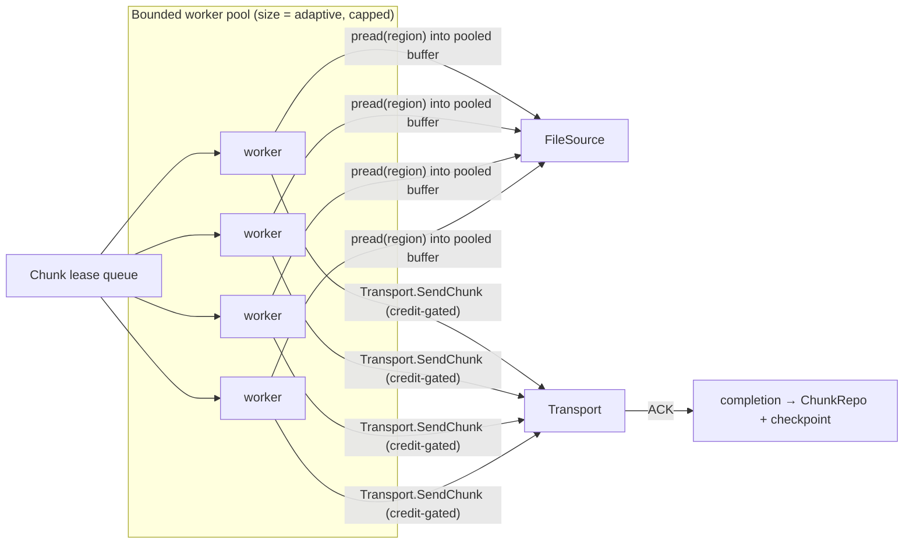

- **Bounded pool**, size chosen by the scheduler from BDP and CPU, hard-capped (protects CPU/memory). Handles thousands of active chunks by leasing, not by one goroutine per chunk.
- **Streaming, buffer-reuse I/O:** each worker `pread`s its region into a **pooled buffer** (`sync.Pool`); buffers are recycled after ACK. No whole-file buffering; memory ≈ `poolSize × bufferSize`.
- **Zero unnecessary copies:** read → (optional compress) → frame → TLS write reuses the same backing buffer where possible; on the direct path we stream the file region straight into the HTTP body with a limited reader (no intermediate copy). (`sendfile` is unavailable through TLS, so we optimize with pooled buffers and vectored writes instead.)
- **Credit-gated:** a worker cannot send unless flow-control credit exists → clean backpressure with no busy-waiting.
- **Graceful drain:** `context.Context` cancellation on pause/cancel/shutdown; workers finish or abandon the current chunk (which reverts `InFlight → Pending`) and exit; no torn state.

---

## 11. SQLite schema (desktop engine) + server store

### 11.1 Desktop (`uploaderd`) — SQLite

SQLite in **WAL mode**, single-writer (the daemon), `busy_timeout` set, `synchronous=NORMAL` (WAL) with periodic checkpoints. All engine state persists here; this is the source of truth for crash recovery. Migrations are versioned and forward-only.

```sql
-- users: local account cache (no secrets; secrets live in the OS keychain)
CREATE TABLE users (
  id            TEXT PRIMARY KEY,          -- CMS user id
  email         TEXT NOT NULL,
  display_name  TEXT,
  jwt_ref       TEXT,                      -- opaque handle into keychain, NOT the token
  created_at    INTEGER NOT NULL,
  updated_at    INTEGER NOT NULL
);

-- sessions: transport sessions (SLKT or direct)
CREATE TABLE sessions (
  id            TEXT PRIMARY KEY,
  user_id       TEXT NOT NULL REFERENCES users(id),
  transport     TEXT NOT NULL CHECK(transport IN ('slkt','direct')),
  server_addr   TEXT,
  state         TEXT NOT NULL,             -- Active/Reconnecting/Expired/Closed
  opened_at     INTEGER NOT NULL,
  last_seen_at  INTEGER NOT NULL,
  expires_at    INTEGER
);

-- uploads: one row per file transfer (the upload-level state machine)
CREATE TABLE uploads (
  id            TEXT PRIMARY KEY,          -- UploadID
  user_id       TEXT NOT NULL REFERENCES users(id),
  cms_file_id   TEXT,                      -- FileID in the CMS
  source_path   TEXT NOT NULL,
  filename      TEXT NOT NULL,
  size_bytes    INTEGER NOT NULL,
  status        TEXT NOT NULL,             -- Queued/Preparing/.../Completed/Failed/Canceled
  priority      INTEGER NOT NULL DEFAULT 0,
  transport     TEXT,                      -- last used path
  error         TEXT,
  created_at    INTEGER NOT NULL,
  updated_at    INTEGER NOT NULL,
  completed_at  INTEGER
);
CREATE INDEX idx_uploads_status ON uploads(status);

-- upload_manifests: the durable manifest (1:1 with uploads)
CREATE TABLE upload_manifests (
  upload_id     TEXT PRIMARY KEY REFERENCES uploads(id) ON DELETE CASCADE,
  sha256        TEXT,                      -- final file hash (nullable until hashed)
  chunk_size    INTEGER NOT NULL,          -- adaptive; == multipart part size
  chunk_count   INTEGER NOT NULL,
  multipart_id  TEXT,                      -- S3 multipart upload id (from server/control)
  object_key    TEXT,                      -- destination key in Spaces
  session_id    TEXT REFERENCES sessions(id),
  bytes_done    INTEGER NOT NULL DEFAULT 0,
  cur_speed_bps INTEGER NOT NULL DEFAULT 0,
  avg_speed_bps INTEGER NOT NULL DEFAULT 0,
  eta_seconds   INTEGER,
  version       INTEGER NOT NULL DEFAULT 1,
  updated_at    INTEGER NOT NULL
);

-- chunks: per-part state (the chunk-level state machine). "Missing Chunks" = states in (Pending,InFlight)
CREATE TABLE chunks (
  upload_id     TEXT NOT NULL REFERENCES uploads(id) ON DELETE CASCADE,
  idx           INTEGER NOT NULL,          -- part index (0-based)
  offset_bytes  INTEGER NOT NULL,
  length_bytes  INTEGER NOT NULL,
  sha256        TEXT,                      -- per-chunk strong hash
  crc32c        INTEGER,                   -- per-chunk fast hash
  etag          TEXT,                      -- returned by storage on part upload
  state         TEXT NOT NULL,             -- Pending/InFlight/Acked/Verified/Skipped
  retry_count   INTEGER NOT NULL DEFAULT 0,
  updated_at    INTEGER NOT NULL,
  PRIMARY KEY (upload_id, idx)
);
CREATE INDEX idx_chunks_state ON chunks(upload_id, state);

-- workers: worker/stream telemetry snapshots (Worker monitoring)
CREATE TABLE workers (
  id            TEXT PRIMARY KEY,
  upload_id     TEXT REFERENCES uploads(id) ON DELETE CASCADE,
  stream_id     INTEGER,
  state         TEXT NOT NULL,             -- idle/reading/sending/draining
  cur_chunk     INTEGER,
  throughput_bps INTEGER,
  updated_at    INTEGER NOT NULL
);

-- transfer_statistics: time-series for graphs (Transfer Statistics screen)
CREATE TABLE transfer_statistics (
  id            INTEGER PRIMARY KEY AUTOINCREMENT,
  upload_id     TEXT REFERENCES uploads(id) ON DELETE SET NULL,
  ts            INTEGER NOT NULL,
  bytes_delta   INTEGER NOT NULL,
  speed_bps     INTEGER NOT NULL,
  rtt_ms        INTEGER,
  inflight      INTEGER,
  loss_pct      REAL
);
CREATE INDEX idx_stats_upload_ts ON transfer_statistics(upload_id, ts);

-- settings: key/value app + engine settings
CREATE TABLE settings (
  key           TEXT PRIMARY KEY,
  value         TEXT NOT NULL,
  updated_at    INTEGER NOT NULL
);

-- queue: ordered scheduling view (priority/aging); uploads reference this
CREATE TABLE queue (
  upload_id     TEXT PRIMARY KEY REFERENCES uploads(id) ON DELETE CASCADE,
  priority      INTEGER NOT NULL DEFAULT 0,
  enqueued_at   INTEGER NOT NULL,
  eligible_at   INTEGER NOT NULL DEFAULT 0 -- for backoff scheduling
);
CREATE INDEX idx_queue_order ON queue(priority DESC, enqueued_at ASC);

-- logs: structured local logs (Logs screen + export)
CREATE TABLE logs (
  id            INTEGER PRIMARY KEY AUTOINCREMENT,
  ts            INTEGER NOT NULL,
  level         TEXT NOT NULL,
  component     TEXT NOT NULL,
  upload_id     TEXT,
  msg           TEXT NOT NULL,
  fields_json   TEXT
);
CREATE INDEX idx_logs_ts ON logs(ts);

-- events: append-only, tamper-evident audit trail (SOC2). Hash-chained.
CREATE TABLE events (
  seq           INTEGER PRIMARY KEY AUTOINCREMENT,
  ts            INTEGER NOT NULL,
  actor         TEXT,                      -- user id / 'system'
  kind          TEXT NOT NULL,             -- upload.created, chunk.acked, auth.refresh, ...
  upload_id     TEXT,
  payload_json  TEXT,
  prev_hash     TEXT NOT NULL,             -- hash of previous event (chain)
  hash          TEXT NOT NULL              -- H(prev_hash || canonical(payload))
);
```

The manifest fields required by the brief — UploadID, FileID, Filename, Size, SHA256, Chunk Size, Chunk Count, Chunk States, Missing Chunks, Retry Count, Session ID, Current Speed, Average Speed, ETA, Priority, Upload Status — are all covered across `uploads` + `upload_manifests` + `chunks` (Missing Chunks is derived from `chunks.state`, kept cheap via `idx_chunks_state`).

### 11.2 Server store — Postgres (deliberate deviation, see Appendix A)

The brief lists SQLite under "DATABASE", but those tables (`workers`, `queue`, `transfer_statistics`, `settings`) are clearly **client-engine** concepts, and the server is required to be **horizontally scalable with shared storage**. SQLite is single-node and cannot back a multi-instance server. Therefore:

- **Desktop engine → SQLite (embedded).** ✔ matches the brief's table list.
- **Upload server → Postgres / DO Managed DB (shared).** Small footprint: per-upload `multipart_id`, ownership (`user_id`, `cms_file_id`), part index → ETag/sha, status, timestamps, and a **server-side append-only audit table** shipped to central WORM logging. Any server instance can resume/assemble any upload because state is shared. This is flagged for approval in Appendix A.

---

## 12. Server architecture

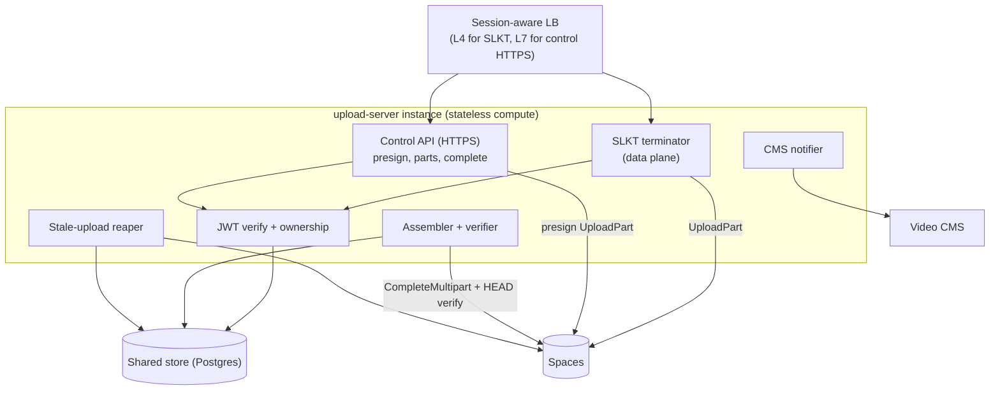

**Responsibilities (all from the brief):** authenticate JWT (verify signature via CMS JWKS, `exp`, `aud`, scope, ownership claim); establish upload sessions; receive chunks (SLKT) and record parts (direct); validate integrity (per-part CRC32C + SHA256, storage checksum); persist upload state (Postgres); recover interrupted sessions (resume from shared state, any instance); assemble completed files (`CompleteMultipartUpload`); verify final checksum (HEAD + sha compare); notify CMS; clean up stale uploads (reaper aborts multipart uploads past TTL, reclaims storage).

**Horizontal scale:** compute instances are stateless; all durable state is in Postgres + Spaces. A session is *pinned* to one instance only while its TCP/SLKT connection is live (L4 affinity by connection); on reconnect the client may land on any instance and resume from shared state. The control (HTTPS) API is fully stateless behind an L7 LB.

**Backpressure at the server:** the SLKT terminator watches its Spaces `UploadPart` latency/queue depth and shrinks client credits (`FLOW_UPDATE`) or sends `BACKPRESSURE` when the storage write path saturates — protecting the instance from memory blowup under 40+ concurrent multi-GB streams.

---

## 13. Storage abstraction

A single port; adapters are swappable. DO Spaces first; the interface is S3-shaped but not S3-leaky, so GCS/Azure adapters are additive.

```go
// packages/storage
type ObjectStore interface {
    InitMultipart(ctx, key string, meta ObjectMeta) (multipartID string, err error)
    // server-in-path: server streams bytes as a part
    UploadPart(ctx, key, multipartID string, partIdx int, r io.Reader, sz int64, sha256 []byte) (etag string, err error)
    // direct failover: hand the client a scoped, short-TTL URL
    PresignUploadPart(ctx, key, multipartID string, partIdx int, ttl, sizeLimit int64) (url string, err error)
    CompleteMultipart(ctx, key, multipartID string, parts []Part) (finalETag string, err error)
    AbortMultipart(ctx, key, multipartID string) error
    Head(ctx, key string) (ObjectInfo, error)
    Get(ctx, key string, rng *ByteRange) (io.ReadCloser, error)
    Delete(ctx, key string) error
    Capabilities() StoreCaps   // multipart limits, checksum algos, presign support
}
```

**Multipart constraints that flow back into chunk sizing (§5.4):** S3/Spaces require parts ≥ 5 MiB (except the last) and ≤ 10,000 parts per upload. Therefore adaptive chunk size is clamped to `max(5 MiB, ceil(size / 10000))` and an upper bound (e.g. 5 GiB/part). For a 5 TB file that yields ~512 MiB parts — one multipart upload covers TB-scale within limits. Sub-5-MiB files use a single `PUT`. This is why the "chunk = part" identity is not just elegant but *bounded and correct*.

**Unified assembly:** whichever path uploaded a given part, its ETag + index land in the shared store; `CompleteMultipart` consumes the full part list. The assembler never branches on transport.

**Storage-side integrity:** enable per-part SHA256 checksums (Spaces supports S3 checksum headers) so storage independently validates each part; the server cross-checks against the manifest's per-chunk SHA256 before `Complete`.

---

## 14. Security model (with SOC2 mapping)

### 14.1 Controls

- **Transport encryption:** TLS 1.3 on every hop (client↔server SLKT, client↔Spaces direct, server↔Spaces, server↔CMS). Optional mTLS for server-fleet internal traffic.
- **AuthN:** CMS-issued JWT. The server verifies signature via the CMS **JWKS**, plus `exp`, `nbf`, `aud`, and an `upload` scope. We **do not modify CMS auth APIs**; we consume them. The daemon refreshes tokens ahead of expiry and stores them only in the OS keychain.
- **AuthZ / ownership:** every chunk, part-record, complete, and presign request is checked against the JWT subject's ownership of `uploadId`/`cms_file_id`. Presigned URLs are scoped to **one object key + one part**, short TTL, with a content-length limit to prevent misuse.
- **Credential storage:** JWTs and Spaces-scoped credentials live in **macOS Keychain / Windows DPAPI (Credential Manager) / Linux Secret Service**. Never plaintext on disk. The SQLite DB stores only opaque handles; optional SQLCipher at-rest encryption for the whole DB (confidentiality).
- **Replay protection:** per-session monotonic `FRAME SEQUENCE` + client/server nonces from the AUTH exchange; idempotent, key-scoped part writes make any replayed CHUNK_DATA a no-op.
- **Integrity / tamper detection:** per-chunk CRC32C (fast) + SHA256 (strong) on the wire; storage-side per-part checksums; **final whole-file SHA256 verified after assembly** before the upload is `Completed` or the CMS is notified. Any mismatch → reject + `ERROR` + audit event; never mark complete.
- **Version negotiation:** HELLO enforces a mutually supported protocol version; downgrade attacks are rejected because the negotiated version is bound into the authenticated session.
- **Session expiration:** idle + absolute TTLs; expired sessions require re-auth then resume.
- **Least-privilege storage IAM:** the server uses scoped Spaces keys (per-bucket, no account root); direct-path clients never hold long-lived storage credentials — only short-TTL presigned URLs.
- **Supply chain:** `go.mod` pinned + checksummed, `govulncheck` + `gosec` in CI, SBOM generated per release, **desktop binaries code-signed & notarized** (macOS notarization, Windows Authenticode) and updates delivered over signed channels.

### 14.2 SOC2 Trust Services Criteria mapping

| TSC | How this design satisfies it |
|---|---|
| **Security (Common Criteria)** | TLS 1.3 everywhere; JWT authN + ownership authZ; least-privilege IAM; keychain-backed secrets; replay + downgrade defenses; dependency scanning, SBOM, signed binaries; local RPC over UDS + per-user token (no network exposure of the engine). |
| **Availability** | Separate supervised daemon (auto-restart); full resume/crash recovery (§15); horizontally scalable stateless servers; server-store backups + DR; health checks & alerting. No upload restarts from zero. |
| **Processing Integrity** | End-to-end checksums (CRC32C + SHA256 + storage checksum + final HEAD verify); idempotent, index-keyed writes; deterministic assembly; `Completed` is gated on verified integrity; reconciliation of part sets. |
| **Confidentiality** | Encryption in transit and (optionally) at rest; data classification of media + identity; scoped short-TTL credentials; retention & deletion policy; secrets never logged (redaction in `logger`). |
| **Privacy** (if in scope) | Minimal PII (CMS identity only); no content inspection beyond hashing; data-subject deletion honored by aborting/removing uploads and purging local state. |

**Cross-cutting audit:** the `events` table is **append-only and hash-chained** (`hash = H(prev_hash ‖ canonical(event))`) on the client; the server ships an equivalent audit stream to **central, tamper-evident (WORM) logging**. All timestamps use NTP-synced clocks so the audit trail is temporally trustworthy. Change management (CI/CD with reviews, signed releases, migration versioning) and incident-response hooks (alertable error events) complete the compliance story.

---

## 15. Failure recovery strategy

Guiding invariant: **nothing critical is memory-only; every state change is persisted before it is acted upon as done; and no upload ever restarts from zero unless the user deletes it.**

| Failure | Detection | Recovery |
|---|---|---|
| **UI window closes / minimized** | n/a | Daemon unaffected; transfers continue; tray shows progress. |
| **UI crashes** | RPC disconnect | Daemon keeps transferring; UI relaunch reconnects and re-reads state from SQLite. |
| **Daemon crashes** | service manager | Auto-restart; on boot the engine loads SQLite, resets any `InFlight` chunks → `Pending`, resumes only missing parts. |
| **Power loss** | on restart | WAL durability + manifest checkpoints; partially-written chunk is discarded and re-sent; DB commits are atomic → no torn manifest. |
| **OS restart** | LaunchAgent/systemd/Service | Daemon auto-starts at login/boot and resumes. |
| **Network drop** | PING timeout / write error | Enter `Reconnecting`; exponential backoff + jitter; `SESSION_RESUME` returns the missing-set; continue. |
| **Custom transport blocked mid-run** | resets/timeouts/DPI | Failover to **direct-to-storage** using the same manifest + multipart id; no restart. |
| **Server instance crash** | connection loss | Reconnect via LB to any instance; shared Postgres holds multipart id + part ETags → resume. |
| **Spaces transient error** | 5xx/timeout | Retry with backoff+jitter; parts are idempotent by index. |
| **JWT expired / revoked** | 401 / verify fail | Silent refresh; if revoked, pause + surface re-login (transfer state preserved). |
| **Disk full (source unreadable / temp)** | I/O error | Pause upload, alert user, resume when resolved. |
| **Checksum mismatch** | verify stage | Mark affected chunk(s) `Pending`, re-send; if final mismatch persists → `Failed` (never `Completed`). |

**Checkpoint cadence:** chunk ACK → persist immediately (cheap, indexed). Manifest speed/ETA aggregates → throttled writes (e.g. every N chunks or T seconds) to avoid write amplification, but *completion facts* (ETag, state) are always durable before being trusted.

---

## 16. Performance optimization strategy

Targets: multi-GB and TB-scale files, long-distance WAN, high BDP, packet loss, intermittent links — maximizing link utilization while remaining fair.

- **Bounded, streaming memory:** `memory ≈ workerCount × bufferSize`, independent of file size. Buffers from `sync.Pool`; no whole-file or whole-chunk-set buffering. A 5 TB upload uses the same RAM as a 5 GB one.
- **Zero unnecessary copies:** read region → (optional compress) → frame → TLS write reuses one backing buffer; direct path streams the file region straight into the HTTPS body via a limited reader.
- **Parallelism tuned to BDP:** on TCP v1, a **connection pool** + multiple data streams overcome single-flow CC ceilings on fat, lossy, high-latency links. Stream/worker count is derived live from `bandwidth × RTT`.
- **App-level congestion control (BBR-inspired):** continuously estimate delivery rate (EWMA) and min-RTT; set pacing rate and in-flight cap to the estimated bottleneck bandwidth; back off on RTT inflation (bufferbloat) to stay fair. Over QUIC, native CC takes over.
- **Adaptive chunk sizing:** bigger parts on stable fat links (fewer round trips, fewer ACKs); smaller on lossy links (cheaper re-sends), clamped to multipart limits (§13).
- **Continuous bandwidth measurement** feeds three knobs at once: parallelism, chunk size, and pacing. Sampled into `transfer_statistics` for the Stats/graphs UI and for diagnostics.
- **Aggressive transient recovery:** failed-only re-send, out-of-order acceptance, idempotent writes → a blip costs one chunk, never the file.
- **OS/socket tuning:** enable send/recv buffer autotuning (large `SO_SNDBUF`/`SO_RCVBUF`), `TCP_NODELAY` on control, larger initial windows where the OS allows; document per-OS knobs in the ops runbook.
- **Compression (optional, smart-default off for media):** most media is already compressed; a quick entropy sample decides. On for text/log sidecars; the `COMPRESSED` frame flag makes it per-chunk.
- **Deduplication (optional):** whole-file SHA256 pre-check (`DEDUP_QUERY`) can make an already-stored file complete **instantly**; per-chunk dedup skips parts already present server-side (`DEDUP_HIT`), valuable for re-uploads and versioned media.
- **Low CPU:** CRC32C uses the hardware CRC instruction; SHA256 uses the SHA extensions where present; hashing overlaps I/O in the streaming pipeline.

---

## 17. Testing strategy

Hexagonal boundaries make everything unit-testable with mocked ports; a virtual `Clock` makes time-dependent logic deterministic.

- **Unit:** state machines (table-driven transition tests), scheduler fairness/aging, missing-set/RLE math, manifest & chunk repos, frame codec.
- **Property-based:** chunk reordering, resume from *any* interruption point, and **idempotency** (re-deliver any chunk any number of times → identical final state).
- **Protocol conformance & fuzzing:** golden wire vectors for every frame type; native Go fuzzing on the frame parser (malformed lengths, truncation, bad CRC, oversized payloads) — the parser must never panic or over-allocate.
- **Integration:** real SQLite + **MinIO** (S3-compatible) standing in for Spaces + in-process server; full enqueue→complete→verify.
- **Network fault injection:** `toxiproxy` / `netem` for latency, jitter, loss, partition, and bandwidth caps; assert throughput adaptivity and correctness under 200 ms RTT + 2% loss (high-BDP + lossy).
- **Crash/chaos matrix:** `kill -9` the daemon and the server at every stage (preparing, mid-transfer, mid-assemble); pull the network; simulate power loss (drop unflushed writes). Each row of the §15 table is a test asserting *no zero-restart, no corruption, verified completion*.
- **Scale/soak:** 500 GB+ synthetic files, 40+ concurrent uploads, thousands of active chunks; `pprof` CPU/heap/goroutine profiles; leak detection over multi-hour soak.
- **Security:** authZ tests (ownership, expired/revoked JWT, replayed frames, downgrade attempts), TLS config assertions, presign-scope tests, `govulncheck`/`gosec`, fuzz.
- **E2E:** desktop → server → MinIO → mock CMS webhook, including the **firewall-failover** case (block the SLKT port and assert automatic direct-path completion).
- **CI gates:** unit+integration on every PR; fuzz + fault-injection nightly; scale/soak on a schedule; coverage floor on the domain core.

---

## 18. Incremental implementation roadmap

Build the **simpler, always-works path first**, then layer the custom protocol as a throughput optimization on top of shared machinery. Every phase ships something verifiable.

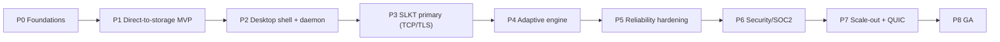

- **P0 — Foundations.** Monorepo + CI/CD; `packages/` skeletons with **ports defined first**; `common`, `logger`, `telemetry`; `database` migrations; MinIO dev harness. *Exit:* interfaces compile, DI composition root wired, empty adapters pass contract tests.
- **P1 — Direct-to-storage MVP (the failover path, built first).** Thin control API mints presigned S3 multipart URLs; client hashes, chunks, uploads parts directly, persists in SQLite, resumes, assembles via `CompleteMultipart`, notifies mock CMS. *Exit:* a 100 GB file uploads, survives a `kill -9` mid-run, and resumes to a verified checksum — **without any custom protocol.**
- **P2 — Desktop shell + daemon.** Wails v3 app + `uploaderd` separate process + local gRPC/UDS + per-user token + tray + auto-start; reuse CMS React; real login/JWT + refresh; Queue/History/Settings views over engine state. *Exit:* close the window, upload keeps going; relaunch reattaches.
- **P3 — SLKT primary (TCP/TLS, server-in-path).** `protocol` frames + codec + version/capability negotiation; `transport` SLKT adapter (connection pool, mux, credit flow control, ACKs, resume); server SLKT terminator writing parts to Spaces; **path chooser** with Happy-Eyeballs probe and automatic **failover to P1's direct path.** *Exit:* uploads run over SLKT by default and transparently fall back when the port is blocked.
- **P4 — Adaptive engine.** Live bandwidth/RTT measurement; adaptive chunk size; adaptive parallelism; BBR-inspired pacing; scheduler WFQ + aging; worker-pool tuning; stats graphs + diagnostics screen. *Exit:* measured link utilization ≥ target on emulated high-BDP + loss.
- **P5 — Reliability hardening.** Implement and test the full §15 matrix; chaos + fault injection in CI; TB-scale soak; deterministic recovery verified. *Exit:* every failure row green; no zero-restart.
- **P6 — Security / SOC2.** Keychain integration; hash-chained audit + central WORM shipping; ownership + replay + downgrade defenses; code signing/notarization; SBOM + `govulncheck`/`gosec` gates; observability dashboards; log-redaction audit. *Exit:* controls mapped to TSC and evidenced.
- **P7 — Scale-out + QUIC.** Server on shared Postgres, multi-instance behind session-aware LB, stale reaper, optional compression/dedup; **QUIC transport adapter** added behind the existing `Transport` port to prove the abstraction (engine untouched). *Exit:* two servers share one upload's resume; QUIC path passes the same conformance suite.
- **P8 — GA.** Signed installers, signed auto-update, docs, ops runbooks, on-call alerts. *Exit:* thousands-of-users readiness review passed.

---

## Appendix A — Deliberate deviations from the brief (for approval)

1. **Server DB is Postgres, not SQLite.** SQLite is single-node and cannot back the required horizontally-scalable, shared-storage server. SQLite remains the **desktop engine** store (matching the brief's table list, which is client-shaped). *Requesting approval.*
2. **Engine is a separate process (`uploaderd`), not an in-app goroutine.** This is the only robust way to satisfy "survives UI crash / window close / logout." The brief says "background service"; we implement it as a true supervised OS service.
3. **Chunk ≡ S3 multipart part.** Unifies both data paths under one assembly mechanism and bounds adaptive chunk sizing (5 MiB ≤ part ≤ 5 GiB, ≤ 10k parts). Alternative (server concatenates independent chunk objects) is possible but adds a second assembly mechanism; we recommend the unified model.
4. **Hybrid = protocol-primary + direct-failover** (per your decision), motivated by enterprise firewall/DPI reachability, not just RTT tiering.

## Appendix B — Open questions for review

1. **CMS JWKS / token claims:** does the CMS expose a JWKS endpoint and an `aud`/scope suitable for the upload server to verify, or do we need a token-exchange step? (No CMS auth-API changes intended either way.)
2. **CMS notification contract:** webhook vs. polled callback for "asset ready"; expected payload and idempotency key.
3. **Spaces layout & lifecycle:** bucket/region strategy, key namespace for in-progress parts vs. final assets, and retention for aborted multipart uploads.
4. **SOC2 scope:** confirm which TSC are in scope (Privacy?) and the central logging/WORM target for audit shipping.
5. **Custom SLKT port:** default port for the primary path + whether we also offer SLKT-over-443 (ALPN) before falling back to HTTPS-direct.
6. **Max concurrency & bandwidth defaults** per user tier.

## Appendix C — Glossary

**SLKT** — the custom Slike Transport protocol. **Part/Chunk** — one S3 multipart part; the unit of transfer, retry, and resume. **Missing set** — RLE-encoded set of not-yet-`Acked` parts. **Server-in-path** — bytes traverse the upload server. **Direct path** — client uploads straight to Spaces (failover). **BDP** — bandwidth-delay product. **WFQ** — weighted fair queuing. **uploaderd** — the headless engine daemon.
```
